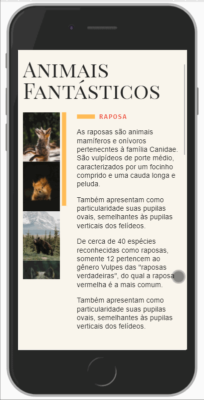

<div align="center">
    <h1> Animais Fantásticos <h1/>
</div>

---


---

<div align="center">
    
</div>

---

# Table of Contents
- [About](#-about)
- [Technologies](#-technologies)

---

## 📝 About
The **Animais Fantásticos** is a website about beautiful wild animals of the planet. It was created during the ***JavaScript ES6+ Course*** by [Origamid](https://origamid.com).

---
## 🚀 Technologies
The project was developed with the following technologies: 

- HTML
- CSS
- JavaScript

---

## 📂 Installation

- Make sure you have npm installed 

- Install eslint globally: 

```bash
$ npm install eslint -g
```

- then install dependencies:

```bash
$ npm install
```

## 👷‍♂️ Build instructions

- For development mode run:

```bash
$ npm run dev
```

- For production mode run:

```bash
$ npm run build
```
---

Made with 💙 by ***João Brosin***.